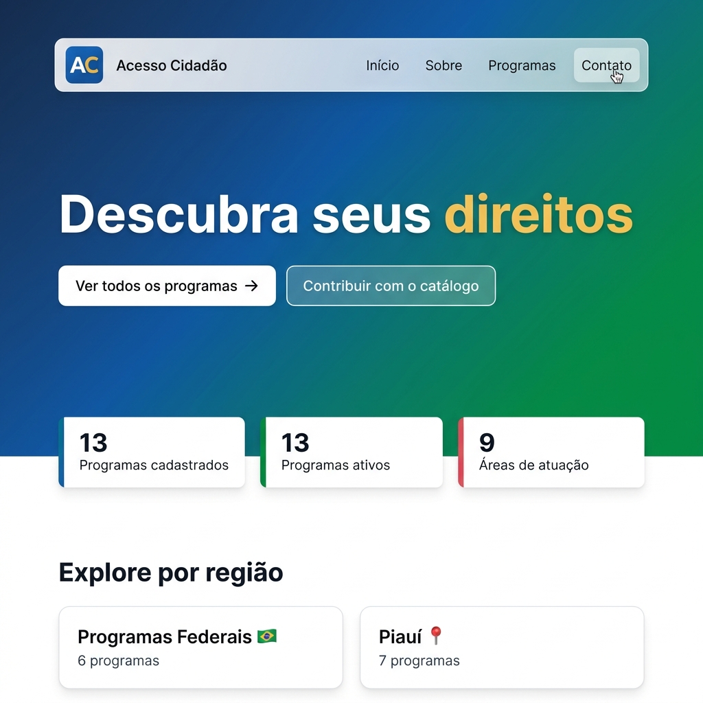
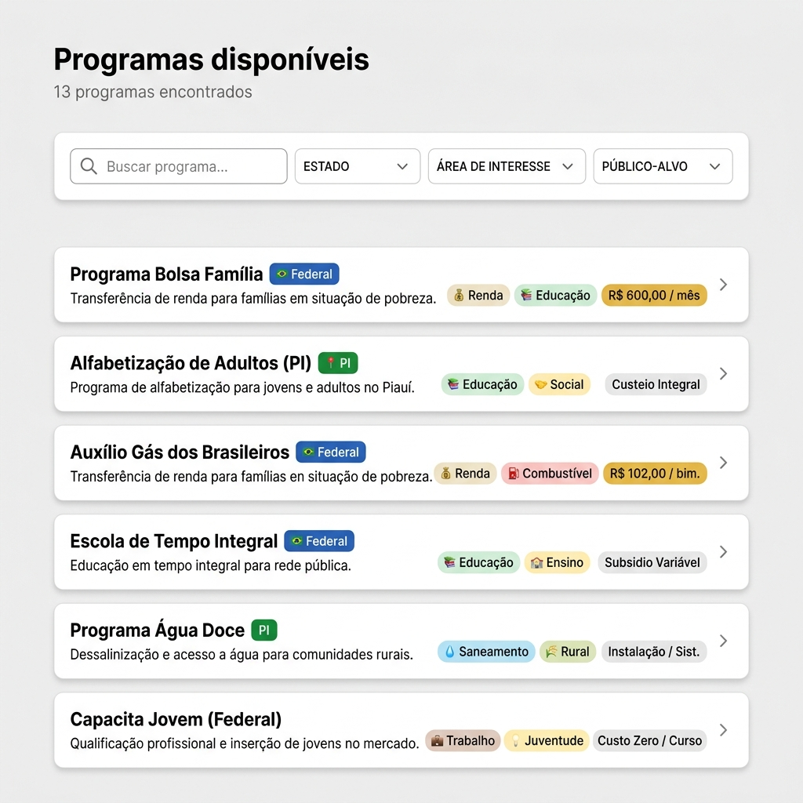
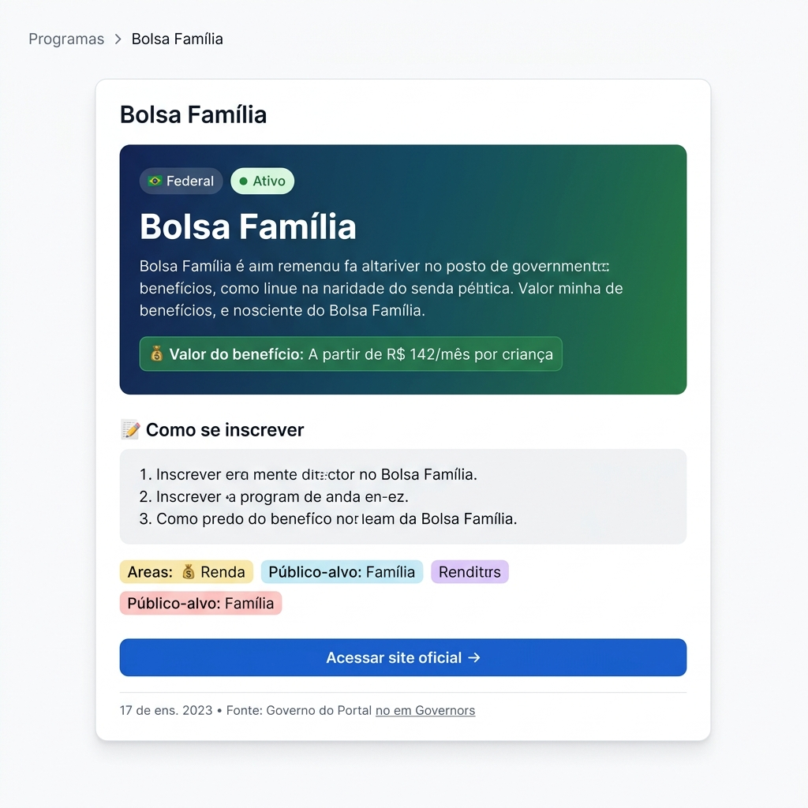

<div align="center">
  

  <h1>Acesso Cidadão</h1>

  <p>Plataforma open source que conecta cidadãos brasileiros aos programas sociais do governo federal e estadual.</p>

  <p>
    <a href="https://github.com/Dione-b/acesso-cidadao/stargazers"></a>
    <a href="https://github.com/Dione-b/acesso-cidadao/issues"></a>
    <a href="https://github.com/Dione-b/acesso-cidadao/blob/main/LICENSE"></a>
  </p>
</div>

---

## ✨ Sobre o projeto

O **Acesso Cidadão** é um catálogo aberto e colaborativo de programas sociais do governo federal e estadual (piloto: Piauí). O objetivo é que qualquer cidadão consiga descobrir, de forma simples, quais benefícios estão disponíveis para ele e como se inscrever.

> A lógica de elegibilidade roda 100% no frontend — sem backends proprietários, sem IA, sem dados pessoais coletados.

## 📸 Screenshots

<table>
  <tr>
    <td align="center">
      <strong>Página inicial</strong><br>
      
    </td>
    <td align="center">
      <strong>Catálogo de programas</strong><br>
      
    </td>
  </tr>
  <tr>
    <td align="center" colspan="2">
      <strong>Detalhe do programa</strong><br>
      
    </td>
  </tr>
</table>

## 🏗️ Arquitetura

```
Frontend (Next.js 15 + App Router)
        ↓
Dados JSON locais (data/)
        ↓
Lógica de matching (lib/matching.ts)   ← 100% client-side
```

| Camada | Tecnologia | Hospedagem |
|--------|-----------|------------|
| Frontend | Next.js 15, TypeScript, Tailwind CSS v4 | Vercel |
| CMS | Strapi v5 | Contabo VPS |
| Banco de dados | PostgreSQL | Supabase |

## 🚀 Rodando localmente

### Pré-requisitos

- Node.js 18+
- pnpm (recomendado) ou npm

### Frontend

```bash
cd frontend
pnpm install
pnpm dev
# Abra http://localhost:3000
```

### CMS (Strapi)

```bash
cd cms
pnpm install
pnpm develop
# Admin em http://localhost:1337/admin
```

## 📁 Estrutura do projeto

```
acesso-cidadao/
├── frontend/
│   ├── app/                  # Rotas (Next.js App Router)
│   │   ├── page.tsx          # Home
│   │   ├── programas/        # Catálogo e detalhe
│   │   └── contribuir/       # Página de contribuição
│   ├── components/
│   │   ├── layout/           # Navbar, Footer
│   │   └── programas/        # ProgramaCard
│   ├── data/                 # JSONs com os programas
│   ├── lib/                  # matching.ts
│   └── types/                # TypeScript types
└── cms/                      # Strapi v5
```

## 🗂️ Modelo de dados

### Programa

| Campo | Tipo | Descrição |
|-------|------|-----------|
| `slug` | string | Identificador único |
| `nome` | string | Nome oficial |
| `esfera` | `federal \| estadual \| municipal` | Nível de governo |
| `areas` | `Area[]` | Áreas de atuação |
| `publicos_alvo` | `PublicoAlvo[]` | Público beneficiário |
| `renda_maxima_per_capita` | number \| null | Limite de renda (null = sem limite) |
| `estados_validos` | string[] | Siglas dos estados ou `["federal"]` |
| `valor_beneficio` | string | Descrição do valor |
| `status` | `ativo \| encerrado \| suspenso` | Situação atual |

## 🤝 Como contribuir

Contribuições são muito bem-vindas! Veja como participar:

1. **Fork** este repositório
2. Crie uma branch: `git checkout -b feat/minha-contribuicao`
3. Faça suas alterações e commit: `git commit -m 'feat: descrição da mudança'`
4. Envie para o fork: `git push origin feat/minha-contribuicao`
5. Abra um **Pull Request**

### Tipos de contribuição aceitos

- 🐛 Correção de bugs
- 📋 Adição de novos programas (via JSON em `data/`)
- 💻 Novas funcionalidades
- 📝 Melhorias na documentação
- 🎨 Melhorias de UI/UX

> Para sugestões e dúvidas, [abra uma issue](https://github.com/Dione-b/acesso-cidadao/issues/new).

## 📄 Licença

Este projeto está sob a licença MIT. Veja o arquivo [LICENSE](LICENSE) para mais detalhes.

---

<div align="center">
  Feito com 💚 para o povo brasileiro
</div>
